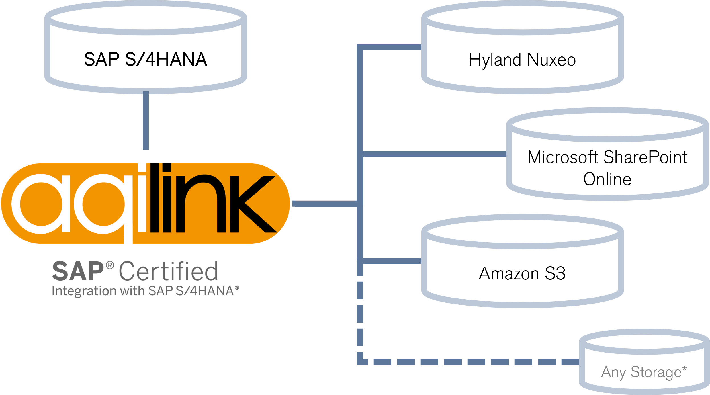

# Get started

Discover our documentation portal to build, operate, maintain or enhance our SAP certified integration **`aqilink`**. Check [our website](https://aqipro.com) to learn more about the product.

   

## Quick Start
1) Request a [trial version](https://try.aqipro.com)
2) You'll be provided with a link to download the Docker image
3) Start the **`aqilink`** container based on the image
4) Store documents from SAP to the content repository

### Prerequisites 
Learn about the requirements to run **`aqilink`** in the [Prereqisites section](/aqilink/readme.md#prerequisites). Supported platforms for the available storage systems are listed in the [Supported Platforms](/aqilink/readme.md#supported-platforms) section.
