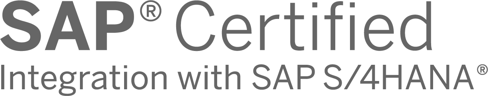

# Get started
This is the main documentation portal for our products:
* **`aqilink`** - SAP certified integration to connect one of the following systems as content repository to SAP S/4HANA:
   * Nuxeo
   * Amazon S3


   


* **`aqishare`** - Low Code data-exchange between SAP and any of the systems above.


## Quick Start
To jump start with one of our products, just ramp up the related Docker image available on DockerHub. 

```
docker pull aqipro/aqilink
``` 

Then, just run it:

``` 
docker run
```


### Prerequisites aqilink
All requirements that must match to run `aqilink` are listed in the [Prerequisites section](/aqilink/readme.md#prerequisites). Supported platforms of the available storage systems are available under the [Supported Platforms](/aqilink/readme.md#supported-platforms) section.


### Prerequisites aqishare

All requirements that must match to run `aqishare` are listed in the [Prerequisites section](/aqishare/readme.md#prerequisites). Supported platforms of the available storage systems are available under the [Supported Platforms](/aqishare/readme.md#supported-platforms) section.