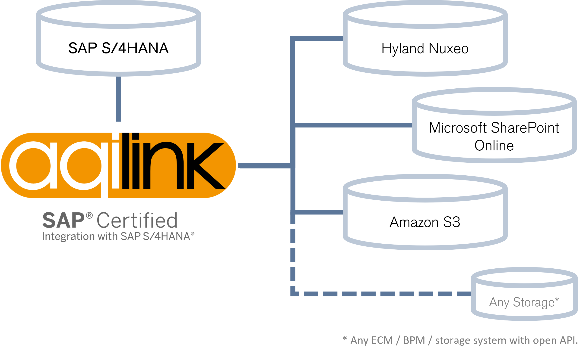

# Get started

Discover our documentation portal to build, operate, maintain or enhance our SAP certified integration **`aqilink`**. Check [our website](https://aqipro.com) to learn more about the product. Would you rather watch videos than reading text? Then visit our [Youtube channel](https://www.youtube.com/channel/UCoY_TGyXEJkpK7LVxJNWHYg).

   

## Quick Start
1) Request a [trial version](https://try.aqipro.com)
2) Download the **`aqilink`** Docker image and [install it](./installation/)
3) Do some basic [configuration](./configuration/) to connect SAP with the repository
4) Start using it
5) Dive deeper and replicate any additional metadata you want from SAP to your repository using our [Data Exchange](/docs/aqishare/) module

## Supported Repositories 
Our SAP certified `aqilink` integration serves the following repositories: 
* Hyland Nuxeo (Content Management and Digital Asset Management)
* Microsoft SharePoint Online (web-based collaborative platform that integrates natively with Microsoft Office)
* Amazon S3 (Cloud Storage)