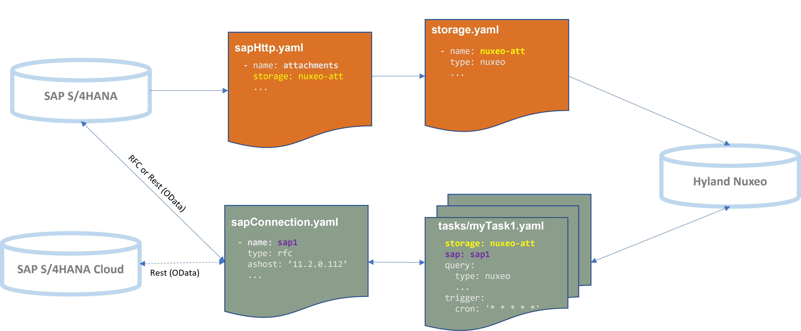

# Configuration
This chapter provides a detailed explanation of how to configure the*Document Exchange* and *Data Exchange* components of **`aqilink`**. The primary configuration is divided into separate [YAML files](https://yaml.org) files to ensure maximum flexibility. Before delving deeper into the available configuration options, the subsequent sections will offer a bird's-eye view of how these configuration files relate to one another. This will simplify the process of determining which configuration file needs adjustment to achieve the desired behavior.

## Component Overview <!-- {docsify-ignore} -->
Before proceeding, let's familiarize ourselves with the *Document Exchange* and *Data Exchange* components to understand their differences and significance. By understanding these components, you can begin the configuration in the right place.

| Name      | Description | Related Configuration Files
| ----------- | ----------- |----------- |
| *Document Exchange* (**``aqilink``**) | The *Document Exchange* is the SAP-certified component of the product. It handles all the traffic **from** the SAP HTTP-Content-Server **to** the associated repository. Since this is the primary component, it shares the same name as the product itself: **`aqilink`**.  | ``sapHttp.yaml``, ``storage.yaml`` |
| *Data Exchange* (**``aqishare``**) | The *Data Exchange* component is responsible for all metadata-related actions, starting **from** the associated repository and connecting **to** a desired SAP system. It can be used to trigger any action in the related SAP system by calling Rest services (OData) or by calling function modules through RFC. This component is also known as **`aqishare`**.   | ``sapConnection.yaml``,   ``storage.yaml``,   ``/tasks/myTask1.yaml``,   ``/tasks/myTask2.yaml``,   ... |

> Note: The *Data Exchange* (``aqishare``) component needs to be licensed separately.

## Configuration Files Overview <!-- {docsify-ignore} -->
The table below lists all available configuration files and their purposes. As mentioned above, these files are in `YAML` format.

| File      | Description |
| ----------- | ----------- |
| ``sapHttp.yaml`` | Defines all connections **from** the SAP HTTP-Content-Server and maps it to the related storage. |
| ``storage.yaml`` | Defines all connections **to** the related repositories. This is the only file which is required by both, `aqilink` and `aqishare`.  |
| ``sapConnection.yaml`` | Defines all connections **to** related SAP Systems either via Rest (OData) or RFC.  |
| ``tasks/myTask1.yaml``,  ``tasks/myTask2.yaml``,   ``tasks/myTaskx.yaml`` | Defines the action based on the connection. For each action, a separate file has to be created with a unique name within the folder ``tasks/``. This file name itself can be set to any name but should not contain special characters. These are the most important files for the connection **from** the repository **to** the SAP System and requires the most attention during the configuration.   |

## High-level File Association & Flow <!-- {docsify-ignore} -->
To better visualize how the above files are interconnected, refer to the image below. Once you have an understanding, you can proceed with the configuration of either [*Document Exchange*](/configuration/aqilink/) or [*Data Exchange*](/configuration/aqishare/).

