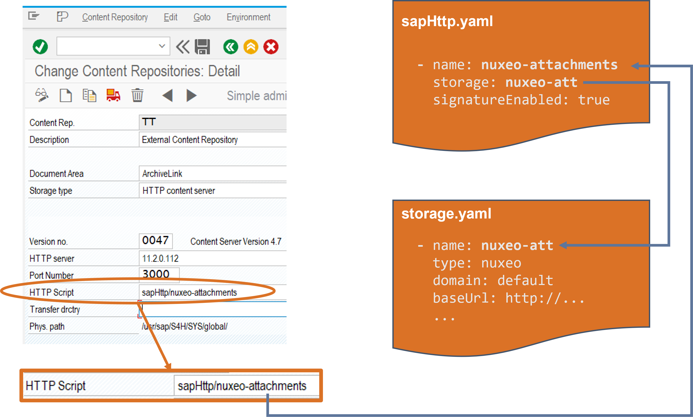

# Configure *Document Exchange*

This chapter explain the configuration options for the *Document Exchange* (**`aqilink`**) module, which connects SAP to a content repository. The primary configuration is divided into two separate `YAML` files to provide maximum flexibility.


| File      | Description | 
| ----------- | ----------- |
| ``sapHttp.yaml`` | Defines all HTTP inbound connections from the SAP system and maps it to the related section in the `storage.yaml`.  |
| ``storage.yaml`` | Defines the connection parameters to connect to the reqired repository. |

The following image illustrates the relationship between the two files, specifically the property values within them. It highlights the primary mapping point between the Content Repository configuration in SAP and the  `sapHttp.yaml`.



## SAP HTTP-Content-Server Connection
The `sapHttp.yaml` defines the inbound connections from the SAP system and maps them to the corresponding repository configuration of the [Storage Connections](#storage-connections). Each inbound connection comprises the three properties listed in the table below.

> Depending on the **`aqilink`** license there can be as many definitions as required in this file.

| Parameter      | Mandatory | Description | Example |
| ----------- | ----------- |----------- | ----------- | 
| ``name`` | Yes |   **Unique** name for each connection. Should contain the name of the repository as the same name has to be used as URL parameter for `Http Script` of the SAP Content Repository configuration. By that, it's possible to identify the connected repository in SAP at a glance. |  `nuxeo-attachments` |
| ``storage`` | Yes | The repository definition in the `storage.yaml` to be used. Should reasonably contain the name of the repository. <br/>Other best practice: Do not use special characters or spaces. Use latin characters, hyphens and numbers only.     |  `nuxeo-att` |
| ``signatureEnabled`` | Yes | If set to `false` the signature check for all incoming requests regarding the SAP system is disbaled. Use with care! Default should be `true`      | ```true```|


## Storage Connections
The `storage.yaml` defines the connection parameter to the related repositories. 

> Depending on the **`aqilink`** license there can be as many definitions as required in this file.

### Hyland Nuxeo Repository
The below table lists all available parameters for the `storage.yaml` to establish a connection to a Hyland Nuxeo repository. For example configurations refer to the [related part in the Reference section](../reference/nuxeo-reference-configs#example-configuration-for-storageyaml) or see [Step-by-step: Connect SAP with Nuxeo](/configuration/storages/nuxeo).

| Parameter      | Mandatory | Description | Example |
| ----------- | ----------- |----------- | ----------- | 
| ``name`` | Yes | Must match the exact name as provided for parameter `storage` in the [SAP Content Server Connection](#sap-http-content-server-connection) (`sapHttp.yaml`).       |  `nuxeo-att` |
| ``type`` | Yes | The type of the repository that should be connected. As the connection routes to Nuxeo, the value must be `nuxeo`. |  `nuxeo` |
| ``domain`` | No | The Domain under the Nuxeo Root which contains the Workspaces with documents. Default is `default`       | `default` |
| ``baseUrl`` | Yes | The URL to login into Nuxeo, including port number.         | `http://nuxeo:8080/nuxeo` |
| ``user`` | Yes| The user that should be used to login from SAP. We recommend to create a separate Nuxeo user for the `aqilink` connection.      | Administrator |
| ``password`` | Yes | The password for the user above. To increase security, the password can be encrypted. Refer to reference [Password Encryption](../../reference/password-encryption.md)!       | ENC(lax/dfk46dfj54zkltgm) |
| ``adminPath`` | Yes | The path in the repository where the SAP repository files and SAP certificates are stored. We recommend to use always the same `adminPath` for all SAP Content Repositories connected to this Nuxeo instance.      | `/default-domain/workspaces/admin`  |
| ``documentPath`` | Yes | The document root folder for all documents stored via the SAP Content Repository in Nuxeo. The value can be different for each configuration.     | `/default-domain/workspaces/documents`  | 


### Amazon S3 Bucket
The below table lists all available parameters for the `storage.yaml` to establish a connection to an Amazon S3 Bucket. For example configurations refer to the [related part in the Reference section](../reference/s3-reference-configs#example-configuration-for-storageyaml) or see [Step-by-step: Connect SAP with S3](/configuration/storages/s3).

| Parameter      | Mandatory | Description | Example |
| ----------- | ----------- |----------- | ----------- | 
| ``name`` | Yes | Must match the exact name as provided for parameter `storage` in the [SAP Content Server Connection](#sap-http-content-server-connection) (`sapHttp.yaml`).       |  `s3-archive` |
| ``type`` | Yes | The type of the repository that should be connected. As the connection routes to an Amazon S3 bucket, the value must be `s3`. |  `s3` |
| ``endPoint`` | Yes | The host name or IP address to access the bucket, refer to [Methods for accessing a bucket](https://docs.aws.amazon.com/AmazonS3/latest/userguide/access-bucket-intro.html) in the official AWS S3 documentation.      | `https://s3.myregion.amazonaws.com` |
| ``port`` | Yes | TCP/IP port number of the `endPoint` above.       | `9000` |
| ``useSSL`` | Yes | Set to `true` to use HTTPS instead of HTTP. Default is `true`.       | `true` |
| ``accessKey`` | Yes| The key to uniquely identify the Amazon S3 account.      |  |
| ``secretKey`` | Yes |  The secret key (password) to login with the `access Key`      |  |
| ``bucket`` | Yes | The name of the bucket in the Amazon S3 account where the documents from SAP should be stored.     | `sap-archive` |
| ``prefix`` | Yes | Prefix for all documents stored via the SAP Content Repository in the bucket. | `AL`  | 
| ``sessionToken`` | No |  Provide the `x-amz-security-token`.       |  |
| ``region`` | No |  Override the region cache.       | `us-west-2` |
| ``transport`` | No |  Pass a custom transport.      |  |
| ``partSize`` | No |  Override the default part size of 64MB for multipart uploads.      |  |
| ``pathStyle`` | No |  Override default access behavior (path) for non AWS endpoints.      | `true` |

### Microsoft SharePoint Online (SPO)
The below table lists all available parameters for the `storage.yaml` to establish a connection to a Microsoft SharePoint Online site. For example configurations refer to the [related part in the Reference section](../reference/s3-reference-configs#example-configuration-for-storageyaml).

| Parameter      | Mandatory | Description | Example |
| ----------- | ----------- |----------- | ----------- | 
| ``name`` | Yes | Must match the exact name as provided for parameter `storage` in the [SAP Content Server Connection](#sap-http-content-server-connection) (`sapHttp.yaml`).       |  `ms-sharepoint-archive` |
| ``type`` | Yes | The type of the repository that should be connected. As the connection routes to a SharePoint Online site, the value must be `sharepoint`. |  `sharepoint` |
| ``adminPath`` | Yes | The path in SharePoint where the SAP Content Repository files and SAP certificates are stored. Use a separate Document Library (recommended is even a separate SharePoint Site) for all SAP Content Repositories. |  `SAPRepositories/Repositories` |
| ``documentPath`` | Yes | The document root folder for all documents from the current SAP Content Repository. |  `SAPDocuments/ArchiveLink` |
| ``sharepointUrl`` | Yes | The Url of the SharePoint tenant.      | `https://mycompany.sharepoint.com` |
| ``tenantName`` | Yes | The tenant name of SharePoint.       | `mycompany` |
| ``siteName`` | Yes | The site name in the tenant to store documents from SAP.       | `sapdemo` |
| ``tenantId`` | Yes| The unique tenant ID. This information can be found in the Azure AD Admin Center. [Microsoft documentation: Find your Microsoft 365 tenant ID](https://learn.microsoft.com/en-us/sharepoint/find-your-office-365-tenant-id)      | `<TenantId>` |
| ``clientId`` | Yes |  The client Id, related to the Certificate of the registered [App in the Azure AD](https://portal.azure.com/#view/Microsoft_AAD_RegisteredApps).      | `<ClientId>` |
| ``thumbprint`` | Yes | Related to the Certificate of the registered [App in the Azure AD](https://portal.azure.com/#view/Microsoft_AAD_RegisteredApps).     | `<ThumbprintId>` |
| ``privateKey`` | Yes | The private key of the Certificate of the registered [App in the Azure AD](https://portal.azure.com/#view/Microsoft_AAD_RegisteredApps). | `<PrivateKey>`  |