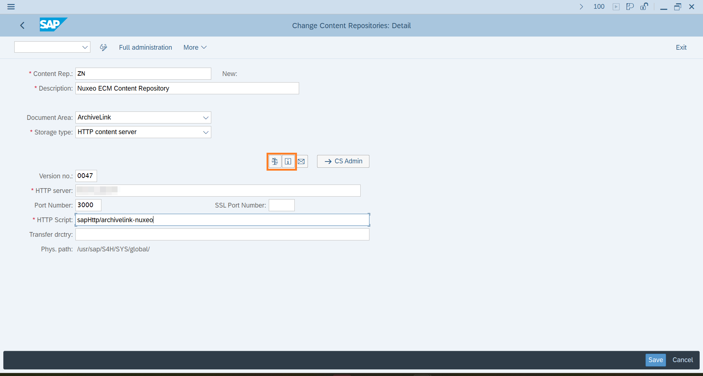
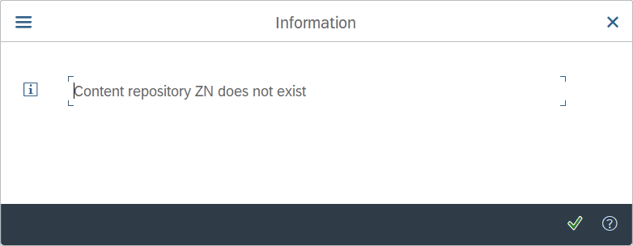
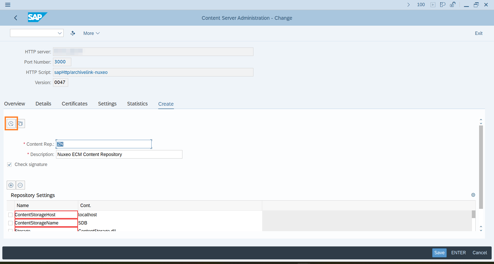
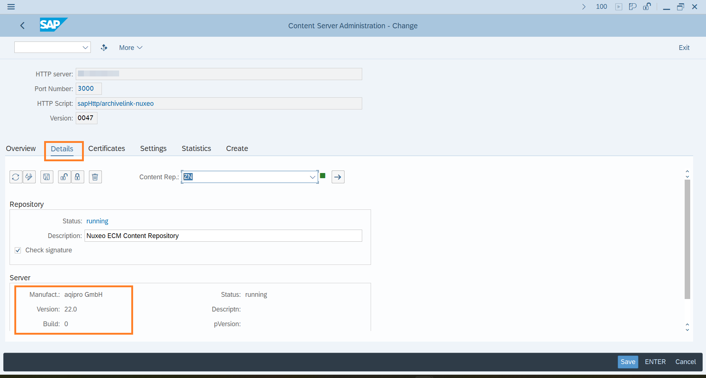
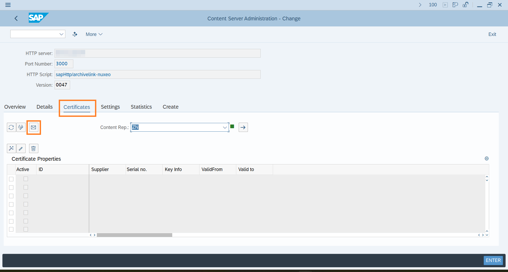
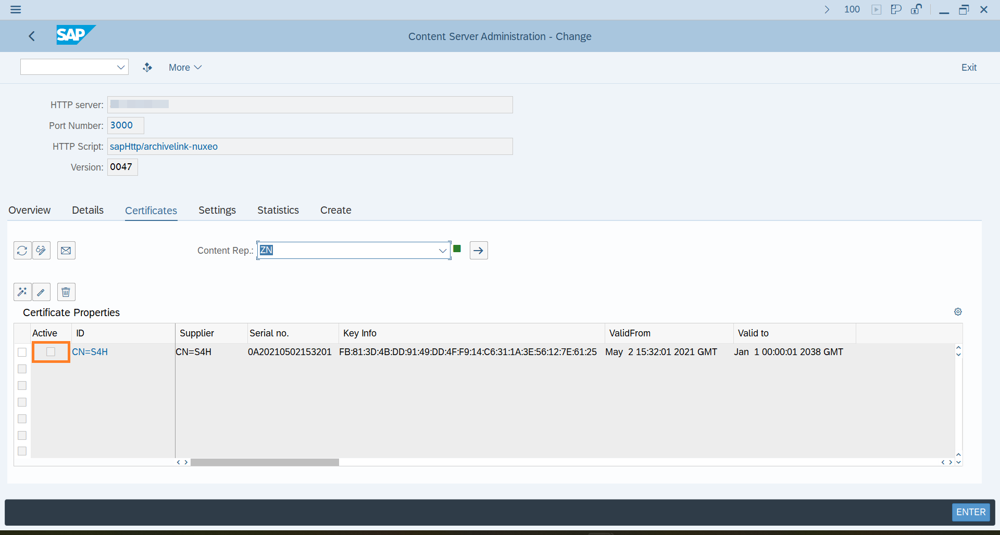
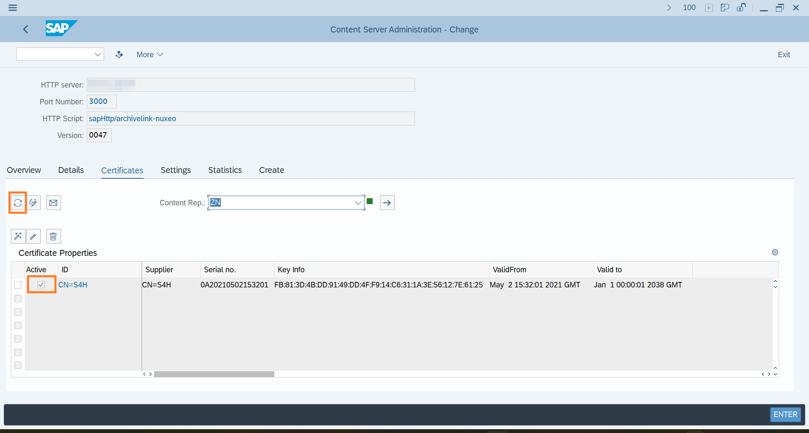
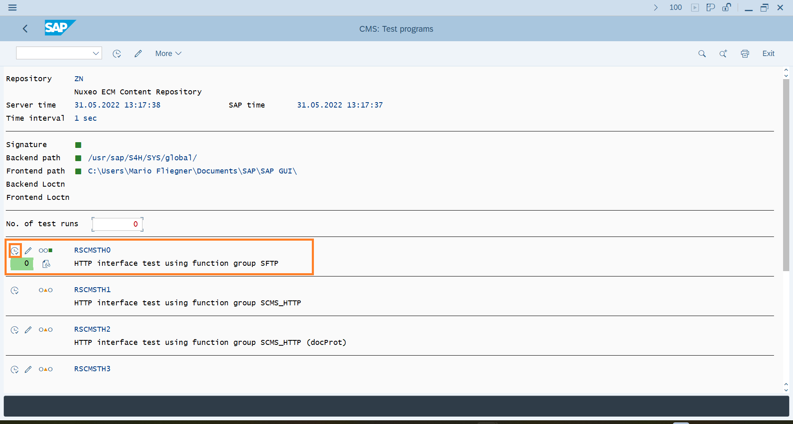
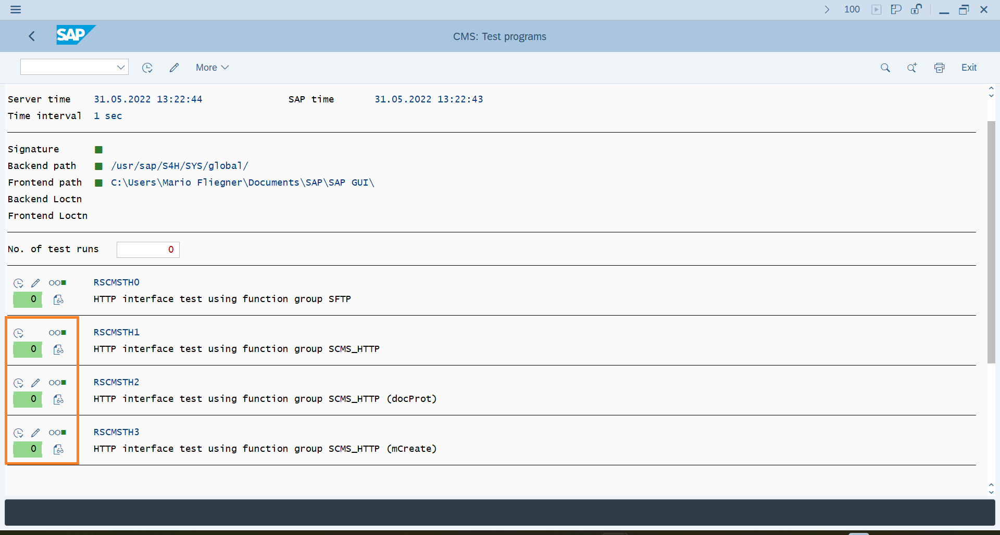

# Step-by-step: Connect SAP with Nuxeo
Read this chapter to learn how to connect Nuxeo  via **`aqilink`** as SAP Content Repository. Make sure you're familiar with the configuration for [SAP Content Repository Connection](/installation/#sap-http-content-server-connection) and [Storage Connection](/configuration/aqishare/#storage-connections) before, as this is a prerequisite.

> Check the [related Playlist on our Youtube channel](https://youtube.com/playlist?list=PLe5MRttD46M34mEYBGFvEKZVdQWER3QIW) to watch the steps below as video tutorial. 

## Create SAP Content Repository
Follow these steps to create a new SAP Content Repository connected to **`aqilink`**.

> Use a SAP dialog user with Administration permission.

1) Login to the SAP system and execute the following transaction: `OAC0`. It will display a list of all available SAP Content Repositories in the SAP system.
2) To create a new SAP Content Repository switch to *Edit* mode (`CTRL`+`F4` ), then press `F5`.  
3) Now create a new entry using the following values:

   | Property      | Description | Example |
   | ----------- | ----------- | ----------- | 
   | **Content Rep.** | Unique name for the repository in SAP.  |  `ZN`, `T1` |
   | **Description** | A description to identify the repository easily. Visible only to SAP admin in the SAP Content Repository overview.  |  `Nuxeo ECM Content Repository` |
   | **Document Area** | Select `ArchiveLink` from the dropdown list to use ArchiveLink and Attachment functionality. Select `Document Management System` to use SAP DMS (Document Info Records).  |  `ArchiveLink`, `DMS` |
   | **Storage Type** | Always select `HTTP content server` from the list. |  `HTTP content server` |
   | **Version no.** | Specify the SAP Content Server version. Supported are `0045`, `0046` and `0047` (recommended for all SAP S/4HANA systems) . |  `0047` |
   | **HTTP server** | Specify the server, IP address or hostname, where `aqilink` is running. |  `11.2.0.112` |
   | **Port Number** | Specify the port on the `aqilink` server above where the app is running. Default: `3000`. If necessary change the port mapping based on the used orchestration tool. |  `3000` |
   | **HTTP Script** | The main entry point of the `aqilink` app. It always starts with the prefix **`sapHttp`** followed by an existing `name` property in the `sapHttp.yaml`. Refer to [SAP Content Repository Connection](/configuration/aqilink/#sap-http-content-server-connection). |  `sapHttp/archivelink-nuxeo` |
   | **Transfer drctry** | Some ArchiveLink scenarios requires files to be created in a transfer directory (on SAP side) before sending it to the content server. Edit this, if the default value does not match your corporate standard. | `/tmp/`|

   This is how it looks like in the SAP GUI:
   

4) Save the newly created repository (`CTRL`+`S`).
5) Test the connection using either the *Test Connection* or *Status information* icon (refer to the `Orange` highlighted buttons in the image above). Now, you should receive a message, that the content repository does not exists.

   

   > If you receive any other message than the above one, make sure the connection to the `aqilink` server is working. In case of a message similar like *`Payment required`* make sure to have entered the (valid) [license key](/installation/app-configuration?id=enter-license-key). 

6) The basic HTTP connection is working now.

## Create Content Repository in Nuxeo
The repository must be created on the content server as well. 

1) Click on icon *--> CS Admin* (*C*ontent *S*erver *Admin*istration) in the middle of the screen, besides the *Test connection* icon. Refer to image in step 3) of the previous section.
2) Create the repository in Nuxeo using the *Create repository* icon in the *Create* section (highlighted in `Orange` below). All settings in this screen can be left with their defaults.

   

3) You should be redirected to the *Details* section where some basic information from the `aqilink` server shows up.
   
   

4) Stay in this screen and continue with the next section.

## Secure Connection using Certificate
Secure the connection between SAP and Nuxeo using a certificate that will be stored in Nuxeo to allow only authorized requests from the SAP Content Repository.

> We strongly recommend securing the connection between SAP and Nuxeo at all times.

1) Click on section *Certificates*.
2) Send the certificate by clicking on the envelope icon.
   
   

3) Once the certificate was sent, it appears in the *Certificate Properties* table. 
   **Note the state of the checkbox!** It is not checked, which means the certificate is not yet active.

   

4) Enable security by activating the certificate in Nuxeo.

   > From the SAP HTTP-Content Server protocol specification, the certificate can only be activated from the content repository side. This is an additional security step. Therefore, no additional action is required in SAP. To proceed with the activation, login to Nuxeo.

   4.1 Login to Nuxeo as with administrator privileges.

   4.2 Navigate to the customized `aqilink` administration folder which holds all the repository files and certificates from the SAP system. Refer to value of setting `adminPath` in the related [Storage Connections](/configuration/aqilink/#hyland-nuxeo-repository) chapter.

   > Underneath this `adminPath` you'll find a folder named with the name you entered as [SAP HTTP-Content Server Connection](/configuration/aqilink/#sap-http-content-server-connection) in value for `HTTP Script` during the repository creation above. The folder is also concatenated by the name of the content repository itself.
   
   

   4.3 The certificate has the extension **`.pem`**. To activate it, edit the properties and tick the checkbox for *Activated* and save the document. 
   
   

   4.4 Crosscheck whether the connection is now secure. Do it in SAP. 

5) Go back to SAP and navigate to the recently created SAP Content Repository again. Open the *--> CS Admin* again and click on the *Certificates* section.
   If the SAP GUI with the screen is still open in the background, just click the *Refresh* icon. 

6) Now, the checkbox in front of the certificate in the *Certificate Properties* table is enabled.

   

7) With that, the SAP Content Repository is successfully connected with Nuxeo. You can proceed with a functional test.

# Functional Test
This section describes how `aqilink`, and therefore the ArchiveLink interface, can be tested. The testing requires some additional SAP fundamentals. Also, it's based on the same procedure used by SAP to certify the `aqilink` ArchiveLink interface.

> In order to successfully complete these tests, all the steps above should have been completed.

1) Login to SAP and open the *ABAP Editor* using transaction `SE38`.
2) Enter `RSCMST` in the Program field and execute it by either click *Execute* in the toolbar or press `F8` to execute it.
   
   

3) In this screen enter the recently created SAP Content Repository, connected to Nuxeo, in the Repository field. Again, click *Execute* in the toolbar or press `F8`.
   
   

4) Now, all related sub-reports are listed that could be executed against the repository.
   
5) The most important report is `RSCMSTH0`, which will test the basic communication like `create`, `info`, `search`, `update` or even `delete` commands via HTTP against the repository. Use the *Execute* icon for the report.

   

6) **Optional:** To test additional functionality of the HTTP interface use the available test reports `RSCMSTH1`, `RSCMSTH2` and `RSCMSTH3`.

   

   > There is a known issue in the `RSCMSTH2` report in SAP BASIS components 740 to 752. If this report returns with a lot of errors regarding document protection like `DOC_P[rc]`, refer to the following SAP OSS notes: 2371386, 2198970. Skip this report unless the notes are implemented.

Congratulations! You now have connected SAP successfully to Hyland Nuxeo and also proofen the technical connection is working fine. You're now able to go ahead and customize your use-cases in SAP to store documents in the new repository (Nuxeo). 