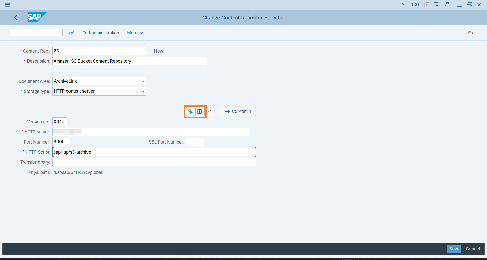
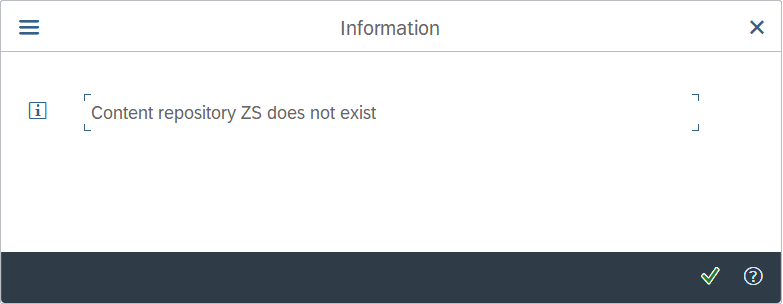

# Step-by-step: Connect SAP with Amazon S3
Read this chapter to learn how to connect an Amazon S3 bucket via **`aqilink`** as SAP Content Repository. Make sure you're familiar with the configuration for [SAP Content Repository Connection](/installation/#sap-http-content-server-connection) and [Storage Connection](/configuration/aqishare/#storage-connections) before, as this is a prerequisite.

## Create SAP Content Repository
Follow these steps to create a new SAP Content Repository connected to **`aqilink`**.

> Use a SAP dialog user with Administration permission.

1) Login to the SAP system and execute the following transaction: `OAC0`. It will display a list of all available SAP Content Repositories in the SAP system.
2) To create a new SAP Content Repository switch to *Edit* mode (`CTRL`+`F4` ), then press `F5`.  
3) Now create a new entry using the following values:

   | Property      | Description | Example |
   | ----------- | ----------- | ----------- | 
   | **Content Rep.** | Unique name for the repository in SAP.  |  `ZN`, `T1` |
   | **Description** | A description to identify the repository easily. Visible only to SAP admin in the SAP Content Repository overview.  |  `Amazon S3 Bucket` |
   | **Document Area** | Select `ArchiveLink` from the dropdown list to use ArchiveLink and Attachment functionality. Select `Document Management System` to use SAP DMS (Document Info Records).  |  `ArchiveLink`, `DMS` |
   | **Storage Type** | Always select `HTTP content server` from the list. |  `HTTP content server` |
   | **Version no.** | Specify the SAP Content Server version. Supported are `0045`, `0046` and `0047` (recommended for all SAP S/4HANA systems) . |  `0047` |
   | **HTTP server** | Specify the server, IP address or hostname, where `aqilink` is running. |  `11.2.0.112` |
   | **Port Number** | Specify the port on the `aqilink` server above where the app is running. Default: `3000`. If necessary change the port mapping based on the used orchestration tool. |  `3000` |
   | **HTTP Script** | The main entry point of the `aqilink` app. It always starts with the prefix **`sapHttp`** followed by an existing `name` property in the `sapHttp.yaml`. Refer to [SAP Content Repository Connection](/configuration/aqilink/#sap-http-content-server-connection). |  `sapHttp/archivelink-s3` |
   | **Transfer drctry** | Some ArchiveLink scenarios requires files to be created in a transfer directory (on SAP side) before sending it to the content server. Edit this, if the default value does not match your corporate standard. | `/tmp/`|

   This is how it looks like in the SAP GUI:
   

4) Save the newly created repository (`CTRL`+`S`).
5) Test the connection using either the *Test Connection* or *Status information* icon (refer to the `Orange` highlighted buttons in the image above). Now, you should receive a message, that the content repository does not exists.

   

   > If you receive any other message than the above one, make sure the connection to the `aqilink` server is working. In case of a message similar like *`Payment required`* make sure to have entered the (valid) [license key](/installation/app-configuration?id=enter-license-key). 

6) The basic HTTP connection is working now.
