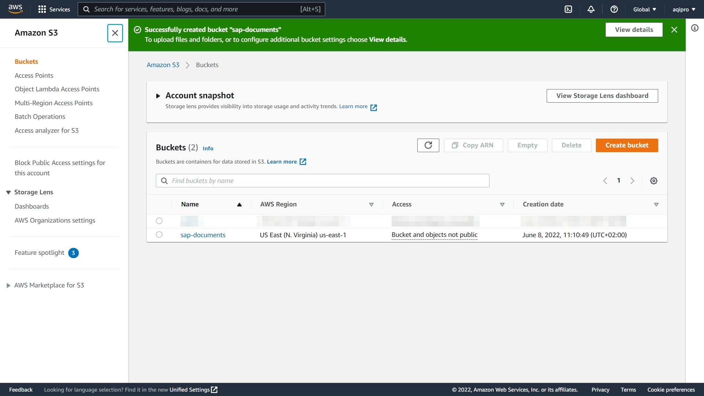

# Step-by-step: Connect SAP with Amazon S3
Read this chapter to learn how to connect an Amazon S3 Bucket via **`aqilink`** as SAP Content Repository. Make sure you're familiar with the configuration for [SAP Content Repository Connection](/installation/#sap-http-content-server-connection) and [Storage Connection](/configuration/aqishare/#storage-connections) before, as this is a prerequisite.

## Create Amazon S3 bucket

> OPTIONAL! If you've already an Amazon S3 bucket available, proceed with section [Create SAP Content Repository](#Create-SAP-Content-Repository).

1) Login to the [AWS S3 Console](https://s3.console.aws.amazon.com/) with your credentials.
2) Click on *Create bucket* to create a new bucket for the SAP documents that should be stored. Specify the related bucket settings according your needs.

   > Remember the *Bucket name* as this must be entered along with some other related AWS connection settings  in the `storage.yaml` configuration file of `aqilink` (refer to [Storage Connections for S3](/configuration/aqilink/#amazon-s3-bucket)).  

   

3) The bucket has been created.

   

## Create SAP Content Repository
Follow these steps to create a new SAP Content Repository connected to **`aqilink`**.

> Use a SAP dialog user with Administration permission.

1) Login to the SAP system and execute the following transaction: `OAC0`. It will display a list of all available SAP Content Repositories in the SAP system.
2) To create a new SAP Content Repository switch to *Edit* mode (`CTRL`+`F4` ), then press `F5`.  
3) Now create a new entry using the following values:

   | Property      | Description | Example |
   | ----------- | ----------- | ----------- | 
   | **Content Rep.** | Unique name for the repository in SAP.  |  `ZS` |
   | **Description** | A description to identify the repository easily. Visible only to SAP admin in the SAP Content Repository overview.  |  `Amazon S3 Bucket` |
   | **Document Area** | Select `ArchiveLink` from the dropdown list to use ArchiveLink and Attachment functionality. |  `ArchiveLink` |
   | **Storage Type** | Always select `HTTP content server` from the list. |  `HTTP content server` |
   | **Version no.** | Specify the SAP Content Server version. Supported are `0045`, `0046` and `0047` (recommended for all SAP S/4HANA systems) . |  `0047` |
   | **HTTP server** | Specify the server, IP address or hostname, where `aqilink` is running. |  `11.2.0.112` |
   | **Port Number** | Specify the port on the `aqilink` server above where the app is running. Default: `3000`. If necessary change the port mapping based on the used orchestration tool. |  `3000` |
   | **HTTP Script** | The main entry point of the `aqilink` app. It always starts with the prefix **`sapHttp`** followed by an existing `name` property in the `sapHttp.yaml`. Refer to [SAP Content Repository Connection](/configuration/aqilink/#sap-http-content-server-connection). |  `sapHttp/s3-archive` |
   | **Transfer drctry** | Some ArchiveLink scenarios requires files to be created in a transfer directory (on SAP side) before sending it to the content server. Edit this, if the default value does not match your corporate standard. | `/tmp/`|

   This is how it looks like in the SAP GUI:
   

4) Save the newly created repository (`CTRL`+`S`).
5) Test the connection using either the *Test Connection* or *Status information* icon (refer to the `Orange` highlighted buttons in the image above). Now, you should receive a message, that the content repository does not exists.

   

   > If you receive any other message than the above one, make sure the connection to the `aqilink` server is working. In case of a message similar like *`Payment required`* make sure to have entered the (valid) [license key](/installation/app-configuration?id=enter-license-key). 

6) The basic HTTP connection is working now.

## Create Content Repository in S3 Bucket
The repository must be created on the content server as well. 

1) Click on icon *--> CS Admin* (*C*ontent *S*erver *Admin*istration) in the middle of the screen, besides the *Test connection* icon. Refer to image in step 3) of the previous section.
2) Create the repository in the Amazon S3 Bucket using the *Create repository* icon in the *Create* section (highlighted in `Orange` below). All settings in this screen can be left with their defaults.

   

3) You should be redirected to the *Details* section where some basic information from the `aqilink` server shows up.
   
   

4) Stay in this screen and continue with the next section.

## Secure Connection using Certificate
Secure the connection between SAP and the Amazon S3 Bucket using a certificate that will be stored in the Bucket to allow only authorized requests from the SAP Content Repository.

> We strongly recommend securing the connection between SAP and Amazon S3 Buckets at all times.

1) Click on section *Certificates*.
2) Send the certificate by clicking on the envelope icon.
   
   

3) Once the certificate was sent, it appears in the *Certificate Properties* table. 
   **Note the state of the checkbox!** It is not checked, which means the certificate is not yet active.

   

4) Enable security by activating the certificate in the the Amazon S3 Bucket.

   > From the SAP HTTP-Content Server protocol specification, the certificate can only be activated from the content repository side. This is an additional security step. Therefore, no additional action is required in SAP. To proceed with the activation, login to Amazon S3.

   4.1 Login to your AWS Account navigate to S3 and view the available Bucket list. 
      
      > The name of the desired bucket must match the value for `bucket`, specified in the `storage.yaml` (refer to [Storage Connections for Amazon S3](/configuration/aqilink/#amazon-s3-bucket)) 

      

   4.2 Open the desired bucket where a new folder *Repository* is available. Enter this folder.

      

   4.3 Below the *Repository* folder you'll find two files. Both are named with the recently created SAP Content Repository name. While the **`.json`** contains some repository information, the **`.pem`** file is the more important. It represents the certificate, sent from SAP which has to be activated.

   

   4.4 Edit the metadata of the **`.pem`** file (e.g., select file and choose *Edit metadata* from *Actions* menu). To activate the certificate, the `x-amz-meta-isactive` property must be changed from `false` to **`true`**.  
   
   

   4.5 Change the value for `x-amz-meta-isactive` and save the file.

   

5) Go back to SAP and navigate to the recently created SAP Content Repository again. Open the *--> CS Admin* again and click on the *Certificates* section.
   If the SAP GUI with the screen is still open in the background, just click the *Refresh* icon. 

6) Now, the checkbox in front of the certificate in the *Certificate Properties* table is enabled.

   

7) With that, the SAP Content Repository is successfully connected with the Amazon S3 Bucket. You can proceed with a functional test.

## Functional Test

The functional test of the ArchiveLink interface of **`aqilink`** is done by the SAP report `RSCMST`. Please follow the steps described in chapter [Functional Test for Nuxeo](configuration/storages/nuxeo.md?id=functional-test) which are similar to test the S3 storage.