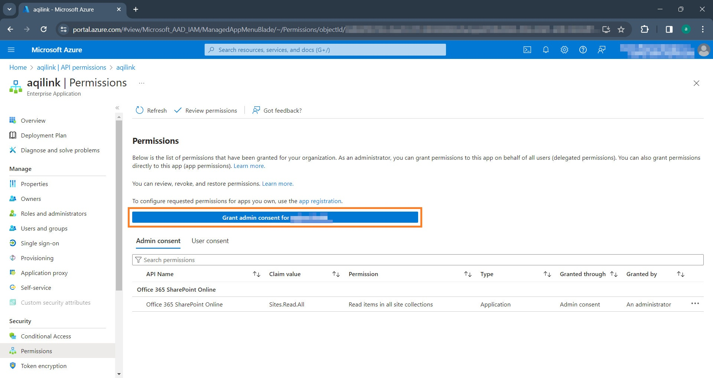
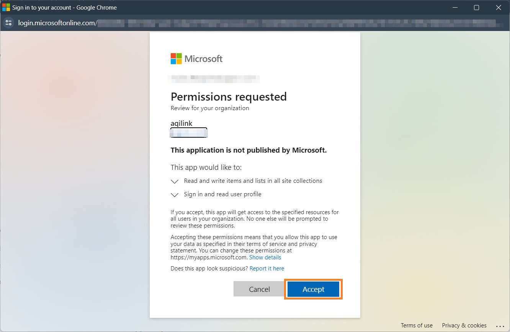

# Create Microsoft Azure Application
Follow these steps to create and register a Microsoft Azure, including all required permissions, before proceeding to the next chapter, [Connect SAP with SharePoint](./sharepoint.md). Note that some outputs of the created Azure AD application are crucial for the configuration in **`aqilink`** as they must be provided to the [Storage Connection](/configuration/aqishare/#storage-connections).

## Register the Application in Azure AD
Follow these steps to create and register the application in Azure AD.

1) Sign in to the Azure Portal: Go to https://portal.azure.com and sign in with your admin account.
2) Click either *App registrations* under the "Azure services" section, or, if it's not there, use the search bar at the top of the portal to find *App registrations* to open it:
   
3) Within the *App registrations* click on *New registration*
    * Provide **`aqilink`** as name for the application.
    * Under supported account types choose *Accounts in this organizational directory only* (pre-selected).
    * Leave the Redirect URI blank, then click "Register."
    
4) The app has been successfully created.

## Upload certificate for secure connection
 After creating the app, a certificate must be generated and uploaded to secure the communication between the **`aqilink`** and SharePoint Online. Follow these steps:

1) **Optional:** Generate a Certificate (if you don't have one): Use tools like OpenSSL or PowerShell to generate a self-signed certificate. Make sure it's saved in a secure location.
2) Upload the Certificate to Azure AD:
    * In the **`aqilink`**'s application overview page click on *Certificates & secrets* tab.
    * Then on "Upload certificate" and select your certificate file.
3) If the upload was successful, you should see the certificate in the list along with some information of it:
   

## Grant Permissions and consent to the application
To allow the **`aqilink`** app to access SharePoint Online, you must grant the necessary permissions. 
1) From the **`aqilink`**'s application overview page click on *API permission* in the menu.
   1) Remove the *User.Read* permission for Microsoft Graph, as this is not required by the **`aqilink`** app.
   2) Add the new permission *Sites.Read.All* from the SharePoint **Application permission** (not "Delegated permission") list
   3) Grant the missing Admin consent for the permission. The section should now look similar to this: 
      

!> Note the link on the bottom of the *API Permissions* page which redirects you to the *Enterprise applications* view!

1) Grant Admin consent to the application 
   1) Navigate to the *Enterprise applications* view (as mentioned above) and review the added permission
   2) Click *Grant admin consent for ...*:
      
    3) Now, you must accept the requested permissions:
      

> All required permissions has been assigned and consent approved. The Azure AD **`aqilink`** application was configured properly.

## Obtaining required information
After setting up the application, it is necessary to note down a few values, as these are required for the [Storage Connection](/configuration/aqilink/?id=microsoft-sharepoint-online-spo) in **`aqilink`**. Navigate back to the Azure AD **`aqilink`** application and collect the following information:

  | Property      | Found in menu ... | Map to key ... in the related [Storage Connection](/configuration/aqilink/?id=microsoft-sharepoint-online-spo) |
   | ----------- | ----------- | ----------- | 
   |**Application (client) ID** | *Overview*  |  `clientId` |
   |**Directory (tenant) ID**   | *Overview*  |  `tenantId` |
   |**Thumbprint** | *Certificates & secrets*  |  `thumbprint` |
   |**Private key (from certificate)** | -  |  `privateKey` |

Example: Find the information for *Application (client) ID* and *Directory (tenant) ID*:

> All is set up. You can now proceed with the configuration of **`aqilink`** to connect SharePoint Online with SAP.