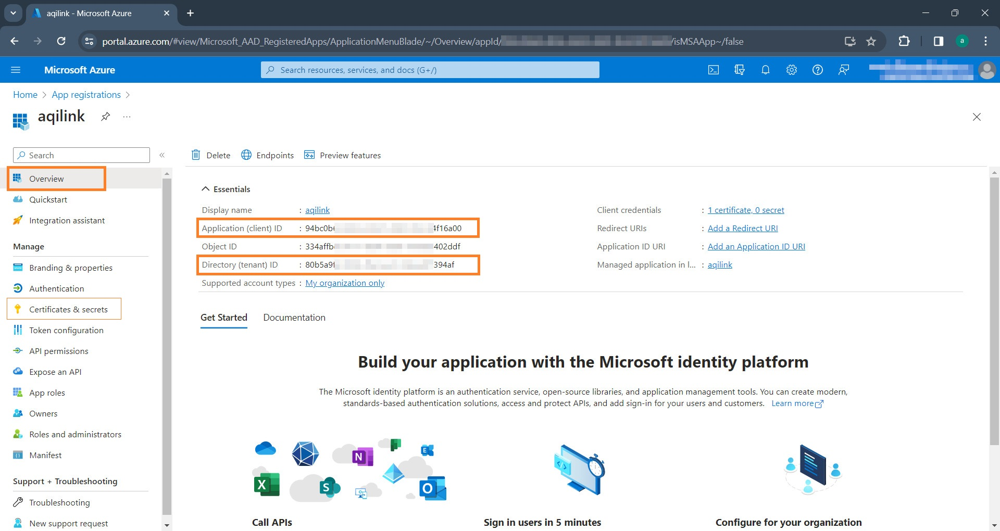

# Create Microsoft Azure Application
Follow these steps to create and register a Microsoft Azure application along with all required permission before proceeding with the next chapter [Connect SAP with SharePoint](./sharepoint.md).

## Register the Application in Azure AD
Follow these steps to create and register the application in Azure AD.

1) Sign in to the Azure Portal: Go to https://portal.azure.com and sign in with your admin account.
2) Click either *App registrations* under the "Azure services" section, or, if it's not there, use the search bar at the top of the portal to find *App registrations* to open it:
   
3) Within the *App registrations* click on *New registration*
    * Provide **`aqilink`** as name for the application.
    * Under supported account types choose *Accounts in this organizational directory only* (pre-selected).
    * Leave the Redirect URI blank, then click "Register."
    
4) The app has been successfully created.

## Upload certificate for secure connection
 After creating the app, a certificate must be generated and uploaded to secure the communication between the **`aqilink`** and SharePoint Online. Follow these steps:

1) **Optional:** Generate a Certificate (if you don't have one): Use tools like OpenSSL or PowerShell to generate a self-signed certificate. Make sure it's saved in a secure location.
2) Upload the Certificate to Azure AD:
    * In the **`aqilink`**'s application overview page click on *Certificates & secrets* tab.
    * Then on "Upload certificate" and select your certificate file.
3) If the upload was successful, you should see the certificate in the list along with some information of it:
   

## Grant Permissions to the application
To allow the **`aqilink`** app to access SharePoint Online, you must grant the necessary permissions. 
1) From the **`aqilink`**'s application overview page click on *API permission* in the menu.
   1) Remove the *User.Read* permission for Microsoft Graph, as this is not required by the **`aqilink`** app.
   2) Add the new permission *Sites.Read.All* from the SharePoint **Application permission** (not "Delegated permission") list
   3) Grant the missing Admin consent for the permission. The section should now look similar to this: 
      

## Obtain required information
After setting up the application, it is necessary to note down a few values, as these are required for the [Storage Connection](/configuration/aqilink/?id=microsoft-sharepoint-online-spo) in **`aqilink`**:

* **Directory (Tenant) ID:** Found on the application overview page under the "Overview" tab. 
  * This value must be passed to key `tenantId` of the related [Storage Connection](/configuration/aqilink/?id=microsoft-sharepoint-online-spo).
* **Application (Client) ID:** Also found on the application overview page. 
  * This value must be passed to key `clientId` of the related [Storage Connection](/configuration/aqilink/?id=microsoft-sharepoint-online-spo).
* **Thumbprint:** Found in tab "Certificates & secrets" of the application.
  * This value must be passed to key `thumbprint` of the related [Storage Connection](/configuration/aqilink/?id=microsoft-sharepoint-online-spo).
* **Private key (certificate):** Was available during the creation of the certificate. 
  * This value must be passed to key `privateKey` of the related [Storage Connection](/configuration/aqilink/?id=microsoft-sharepoint-online-spo).

The registration and configuration of the application in the Azure AD is done. You can now proceed with the configuration of **`aqilink`** to connect SharePoint Online with SAP.