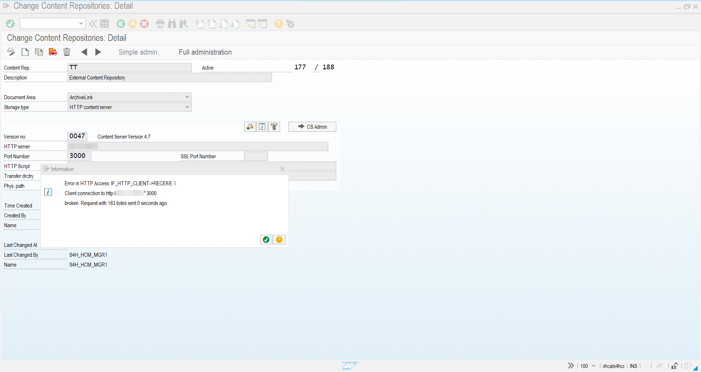
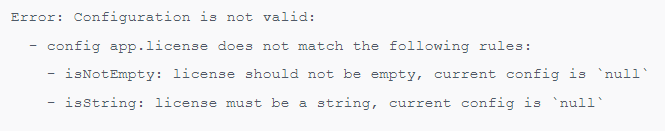
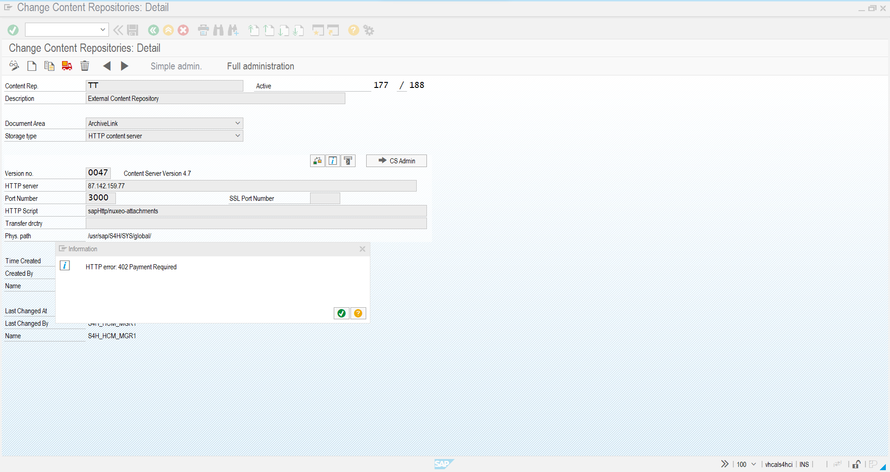

## Frequently Asked Questions

## Troubleshoot `aqilink`
If you have trouble installing or running `aqilink`, the problem may be related to one of the following.

### SAP: Client connection broken
If you receive a similar message below while pinging the connected repository from the SAP Content Repository administration (t-code: `OAC0`), you may check the `app.yaml` in the `/configs` folder. Make sure to enter the license key.

Refer also to the log files in the `aqilink` container. There must be something like the below message that also indicates an issue with the missing license key.

### SAP: 402 Payment required
While testing the connection to the repository through `aqilink` the message returned is `402 Payment Required`. Make sure to have entered the valid license key without typos in the `app.yaml` (Refer to [Basic App Configuration](./installation/app-configuration#basic-aqilink-app-configuration)). If the message still appears, the license may be expired or blocked. In this case reach out to the support team. 

