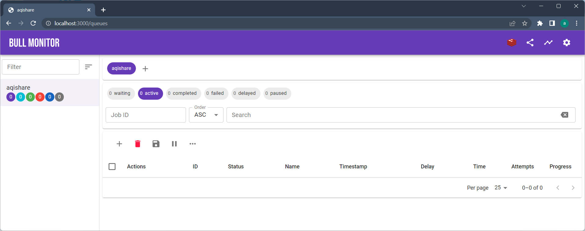

# Basic `aqilink` App Configuration
Basic configuration options related to the **`aqilink`** app are stored in a file named  `app.yaml`.
This file should be created in a `/configs/` directory. The `/configs/` directory in turn must be provided to the **`aqilink`** Docker image or has to be mapped into the running container.

At a glance: Configuration files and structure. 
```
/configs/
    |
    + app.yaml
    + sapHttp.yaml
    + storage.yaml
    + sapConnection.yaml        
    + /tasks/
        |
        + task1.yaml
        + task2.yaml
        + taskX.yaml
```
For the other required files besides the `app.yaml` check the [Configuration](/configuration/) section.

## Enter License Key
The most crucial setting in the `app.yaml` is the license key. This key should be stored under the `license` property of the file. If there is no license key, or if the provided license key is invalid, **`aqilink`** will run in demo mode.

```
license: <ENTER-LICENSE-KEY>
```

## Queue monitoring
To manage the [Tasks](/configuration/aqishare/tasks.md) of **`aqilink`** the [Bull Queue](https://optimalbits.github.io/bull/) is implemented.  The default Web UI for managing queue items is [bull-monitor](https://github.com/s-r-x/bull-monitor), though it is disabled by default. This precaution is taken because, once the Web UI is enabled, queue items can be accessed without any authentication. This allows not just viewing of the items, but also the creation of new ones and the manipulation of existing queue entries.

To enable the Web UI, the property `queueMonitorEnabled` should be added to the `app.yaml` file and set to value `TRUE`, as shown below.

```
queueMonitorEnabled: true
```

> With the setting above, the Web UI is open to the public and can be reached at http://localhost:3000/queues by anyone who knows the IP address and port, without requiring further authentication.

> We strongly advise against enabling the Web UI in production environments. It is designed solely for debugging in development systems.




### Redis Database
As the Bull Queue is based on the open-source database [Redis](https://redis.io), there are many additional settings regarding database configuration available. **`aqilink`** supports all of them, as it simply passes the properties directly to Redis. Check [ioredis](https://github.com/luin/ioredis/blob/v4/API.md) for a full list of available parameters.

The key used to represent Redis-related settings in the `app.yaml` is `redis`. Below are some of the most important properties that influence Redis behavior:

| Property      | Mandatory | Description |
| ----------- | ----------- |----------- |
| ``host`` | No | The host name of the redis database. Default: `localhost`. | 
| ``type`` | No | The port number to reach the database on the host. Default: `6379`.   |  
| ``db`` | No | The number of the database to be used. Default: `0`.   |  
| ``password`` | No | Password to login to the databse.   |  

## Password Encryption
The use of encrypted passwords in configuration files necessitates the specification of the `publicKeyPath` parameter. This parameter should indicate the path within the app to the public key. The key must either be mapped to the container or copied into the image beforehand (as detailed in the chapter [App start](/installation/app-start.md)). If password encryption is not required, this setting can be omitted.

> For details on generating key pairs and setting up password encryption, refer to [Password Encryption](/reference/password-encryption.md) in the reference section.

```
publicKeyPath: /usr/src/app/configs/publicKey.pem
```

## Example Configuration
This is a sample configuration that includes the most relevant properties as explained above. These properties must be present in the `app.yaml` file.

```
license: 12345-67890-09876-54321
queueMonitorEnabled: false
redis:
  host: redis
  port: 6379
publicKeyPath: /usr/src/app/configs/publicKey.pem
```