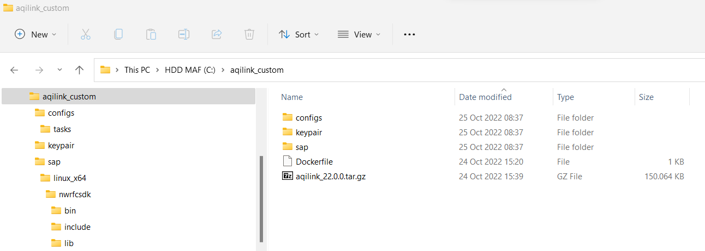
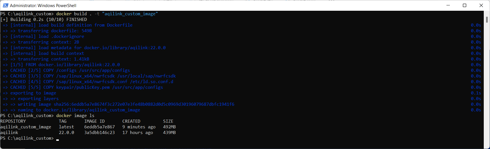

# Start `aqilink` application
Having the [basic app configuration](installation/app-configuration.md) files from the previous section available, it's time to start the container based on the downloaded image. This page will show the process using the container runtime [Docker](https://docs.docker.com). If your company uses another container runtime, adapt the steps accordingly.

## Docker Load
Before creating a container from the `aqilink` image, the image must be extracted from the downloaded *tar.gz* file.
To do so, use the [docker load](https://docs.docker.com/engine/reference/commandline/load/) command.

```
docker load -i aqilink_<VERSION>.tar.gz
   05cb9c26edf8: Loading layer [==================================================>]  19.69MB/19.69MB
   fb429fdee34e: Loading layer [==================================================>]  3.072kB/3.072kB
   314992d6fc2a: Loading layer [==================================================>]  902.1kB/902.1kB
   af98d279c7f6: Loading layer [==================================================>]    191MB/191MB
   418e39625432: Loading layer [==================================================>]  314.9kB/314.9kB
   Loaded image: aqilink:<VERSION>
```

Make sure the image is available by checking with the [docker image ls](https://docs.docker.com/engine/reference/commandline/image_ls/) command:
```
docker image ls
   REPOSITORY      TAG       IMAGE ID       CREATED        SIZE
   ...             ...       ...            ...            ...
   aqilink         <VERSION> ac10911ff112   42 hours ago   439MB
```

## Collect necessary files 

The following steps are necessary as foundation to proceed either with the [Production Mode](#production-mode) or the [Development Mode](#development-mode) part:

- Create a new folder on your machine and copy the following elements into it:
   - The recently downloaded **``aqilink``** Docker image *aqilink_< VERSION>.tar.gz* 
   - The `/configs/` folder containing the **``aqilink``** configuration files (refer to [Basic App Configuration](/installation/app-configuration.md))
   - The folder containing the private and public key pair for password encryption/decryption. Only required if password encryption is used (refer to [Password Encryption](/reference/password-encryption))
   - The SAP NetWeaver SDK files based on your target system architecture (refer to [SAP NetWeaver RFC SDK](/installation/app-download?id=sap-netweaver-rfc-sdk))
- *Production Mode only:* Create a new file with name `Dockerfile` inside the folder

The structure of the folder should now look like:



## Production Mode
The usage of any orchestration tool such as Docker Swarm or Kubernetes requires to have all related files inside the image. To fulfill this requirement, a new custom based Docker image has to be created containing the previously maintained `/config/` folder as well as the SAP NetWeaver SDK.

> Make sure that all settings in the `/configs/` folder are correct.

### Create Dockerfile for custom image

If not yet done, create a file with name `Dockerfile` in the newly created folder (see step above) and copy the below content into it:

 - Replace the `<VERSION>` placeholder with the version of the **`aqilink`** Docker image in the current folder.
 - Make sure that the target path of the last COPY command below match the path in parameter `publicKeyPath` of the `app.yaml` file in the `/configs` folder.

```
FROM aqilink:<VERSION>

ARG SAPNWRFC_HOME='/usr/local/sap/nwrfcsdk'
ENV SAPNWRFC_HOME=${SAPNWRFC_HOME}

COPY /configs /usr/src/app/configs
COPY /sap/linux_x64/nwrfcsdk ${SAPNWRFC_HOME}
COPY /sap/linux_x64/nwrfcsdk.conf /etc/ld.so.conf.d

#Target path of COPY command must match publicKeyPath in /configs/app.yaml
COPY keypair/publicKey.pem /usr/src/app/configs

CMD ["node", "dist/main"]
```

### Build custom image

Use [docker build](https://docs.docker.com/engine/reference/commandline/build/) command to create the new image based on the `Dockerfile` above with a custom specific tag. Navigate to the temporary folder with a command-line shell and execute the following command (while `aqilink_custom_image` is the name of the new image):

```
docker build . -t "aqilink_custom_image"
```

Double-check the successful creation with [docker image ls](https://docs.docker.com/engine/reference/commandline/image_ls/) command again. The output after executing both commands should look like:



### Create docker-compose.yaml
To start the container based on the image, a `docker-compose.yaml` must be created. To do so, create a new file with name `docker-compose.aqilink_custom_image.yaml` and insert the content below. 

> Consult your Docker and/or Orchestration system (Docker Swarm, Kubernetes, etc.) expert to create the file content the correct way.

**Before starting the container make sure to:** 
1) change the image name under the *aqilink:* service according the recently created name used for the custom image
2) change the image name under the *nuxeo* service to the name of the desired Nuxeo image and make sure the port mapping is good and the volume matches. **Note:** The used Nuxeo image must contain the required `aqilink-nuxeo` module (refer to [Other related software](/installation/app-download?id=other-related-software))!

```
version: '3.9'

services:
  aqilink:
    image: aqilink_custom_image:latest
    ports:
      - 3000:3000
    depends_on:
      - redis
    networks:
      - sapnet
  nuxeo:
    image: nuxeo-lts2021-with-aqilink-nuxeo-module:latest
    ports:
      - 8080:8080
    volumes:
      - data:/var/lib/nuxeo
    networks:
      - sapnet
  redis:
    image: redis
    networks:
      - sapnet
networks:
  sapnet:
volumes:
  data:
    external: true
```

### Start container with docker-compose
Finally, start the container based on the `YAML` above using the `docker-compose` command:

```
docker-compose -f docker-compose.aqilink_custom_image.yaml up -d
```

### Start container with Docker Swarm

You can use the created `YAML` file also to go ahead with Docker Swarm. 


## Development Mode
To ramp up **`aqilink`** quickly and to test different configuration options and settings easily, we recommend to use the following `docker-compose.yaml` file along with [docker-compose](https://docs.docker.com/compose/) command as template. This should only be used in development systems.

Create a `docker-compose.yaml` within the new folder with the following content:
```
version: '3.9'

services:
  main:
    platform: linux/amd64
    volumes:
      - ./sap/linux_x64/nwrfcsdk:/usr/local/sap/nwrfcsdk
      - ./sap/linux_x64/nwrfcsdk.conf:/etc/ld.so.conf.d/nwrfcsdk.conf
      - ./configs:/usr/src/app/configs
    environment:
      SAPNWRFC_HOME: '/usr/local/sap/nwrfcsdk'
    ports:
      - 3000:3000
    depends_on:
      - redis
    networks:
      - sapnet
  nuxeo:
    image: nuxeo-lts2021-with-aqilink-nuxeo-module:latest
    ports:
      - 8080:8080
    volumes:
      - data:/var/lib/nuxeo
    networks:
      - sapnet
  redis:
    image: redis
    networks:
      - sapnet
networks:
  sapnet:

```


Congratulations. You have successfully downloaded and installed **`aqilink`**, it's time to learn all about the configuration options it offers to make it fit to your company. Please read the next chapter.