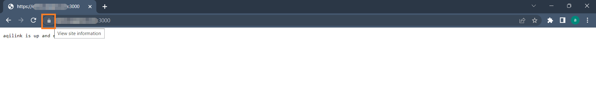
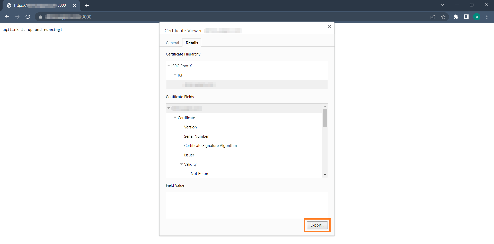
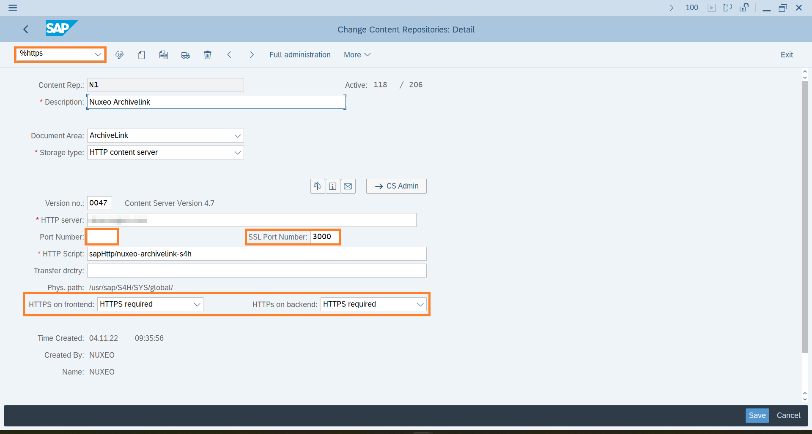
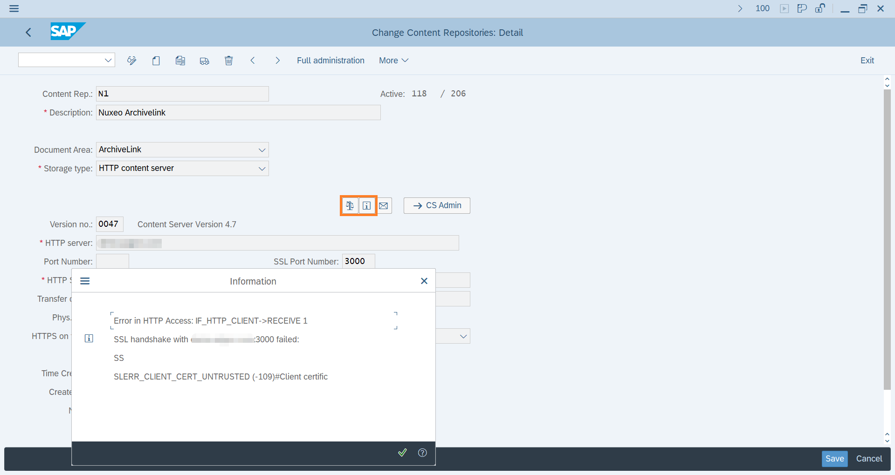
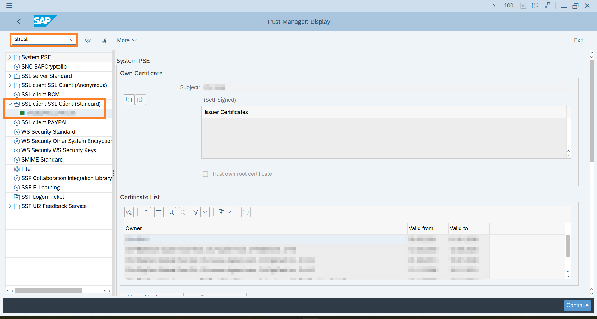
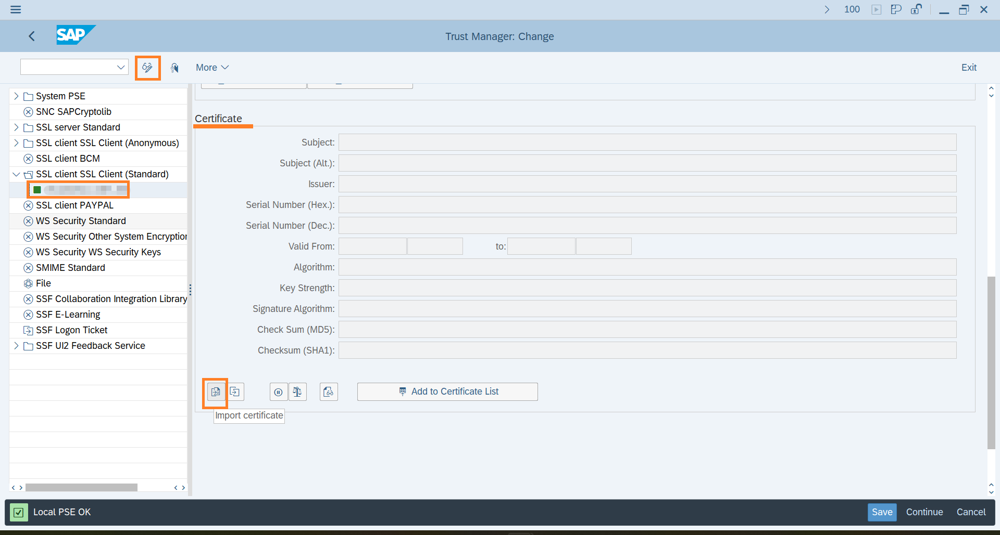
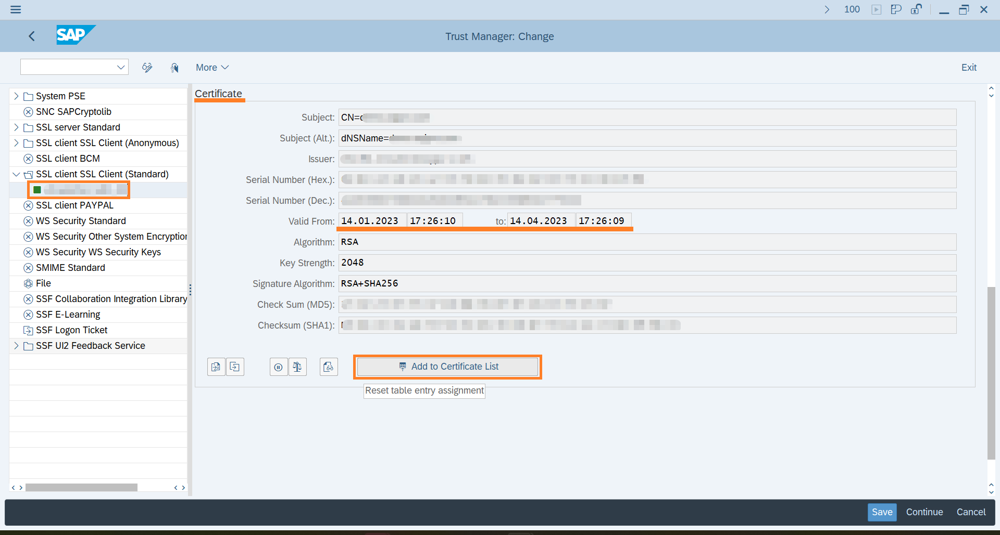
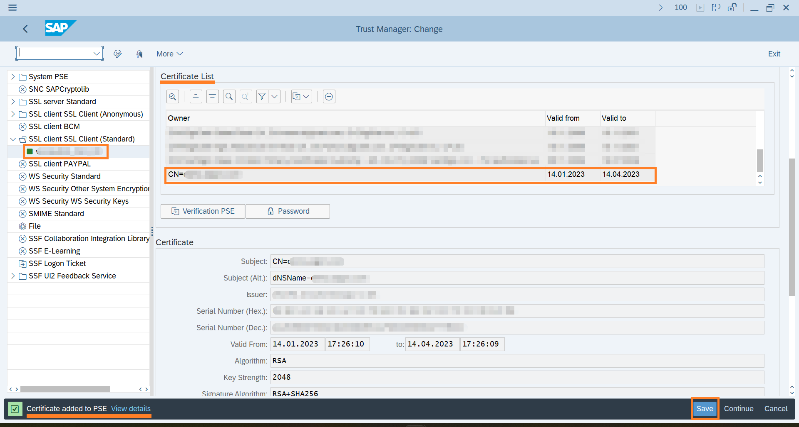
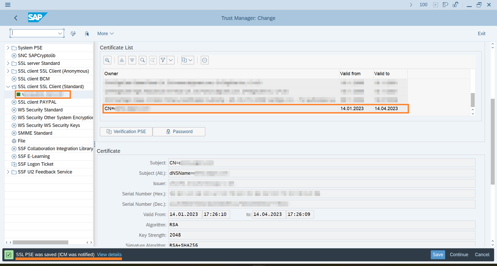
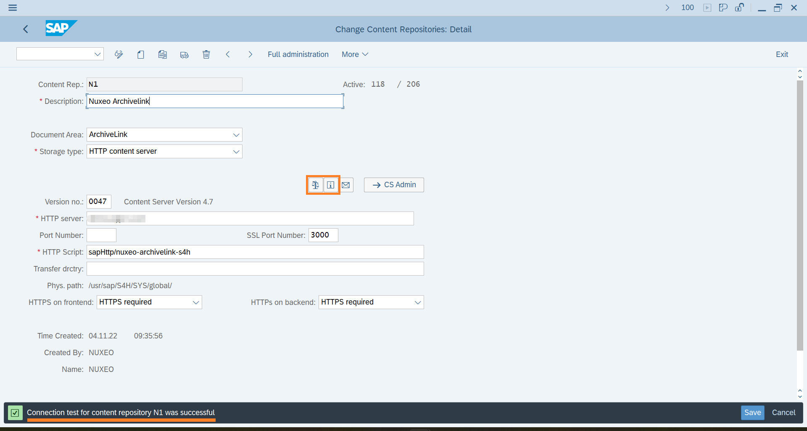

# Communication via HTTPS

Set up a secure communication between SAP and **`aqilink`**.
This chapter describes the necessary steps to implement the certificate from the **`aqilink`** webserver in SAP and prepare SAP Content Repositories to use HTTPS over HTTP for the communication.

### What this chapter not covers
* It does not cover the configuration of the SSL connection on the webserver where **`aqilink`** is installed.
* It does not cover the installation and configuration of the SSL connection on the connected repository.
* It does not cover the creation of the certificate itself. 

## Get current Certificate from ``aqilink``

The certificate used by the **`aqilink`** webserver must be known and imported in SAP. To get and export the certificate use these steps:

1) Open a webbrowser and navigate to host where **`aqilink`** is running using port `3000` (if you've changed the default port in your `Dockerfile` or `docker-compose.yaml` use the port numbery of your setup). Then click the Lock icon in front of the URL to view site information.
   
   Example:
   ```https://localhost:3000```



2) View the currently installed certificate details and export the certificate. In Google Chrome click on *Connection is secure*, then *Certificate is valid* and switch to tab *Details* to find the export button. Save the certificate on the local machine. This file must be now imported to SAP.



## Prepare SAP Content Repository for HTTPS

Follow these steps to prepare the SAP Content Repository to use a secure connection:

1) Open transaction `OAC0`.
2) Choose the desired SAP Content Repository.
3) Enter `%https` (note the percentage sign) in the transaction code field to show required HTTPS related settings. Once the fields appear: 

    1) Remove the value for `Port Number`.
    1) Add the `SSL Port Number`.
    1) Select `HTTPS required` as a value for `HTTPS on frontend`.
    1) Select `HTTPS required` as a value for `HTTPs on backend`.



> Make sure you remove the non-SSL Port Number, otherwise the connection fails.

4) Save the settings for the SAP Content Repository.
5) Try to test the connection to the Content Repository or get information from it by clicking one of the related buttons. Any connection test will now fail with the following error:



To make the SSL connection work, the exported certificate from the previous step must be known to SAP. Therefore, it must be imported in SAP. 

## Import Certificate in SAP PSE

To import the certificate from [above](#get-current-certificate-from-aqilink) to the SAP Personal Security Environment (PSE) follow these steps:

1) Open transaction `STRUST`.
2) Check whether a `SSL Client (Standard)` PSE exists and open it by double-click.

> If there is no `SSL Client (Standard)` PSE available yet, select `SSL Client (Standard)` entry and use the context menu to create a new Personal Security Environment. Use default settings, if applicable.



3) Switch to *Edit* mode, then scroll down until section `Certificate`.
4) Click the `Import certificate` button.



5) Select the previously saved `.pem` file of the [certificate export](#get-current-certificate-from-aqilink) using the File chooser. The certificate now appears with all its details.
6) Finally, click on `Add to Certificate List` to add the certificate to the Certificate list.



7) The certificate from the **`aqilink`** webserver is now available in the trusted certificate list. Validate it by scrolling through the list of certificates to find the entry. Hoewver, the list is not yet saved!



8) Finally click on *Save* to persist the new certificate in SAP. The message in the SAP GUI bottom line should look like:




9) To verify the SSL connection, go back to the SAP Content Repository Administration of the related Content Repository (t-code `OAC0`) and test the connection again. The SSL handshake error regarding untrusted certificate is now gone and the connection through HTTPS works fine:



The communication via HTTPS between SAP and the **`aqilink`** webserver is now done.