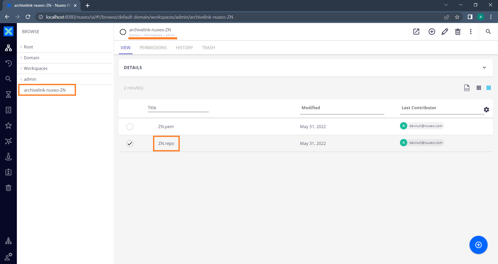
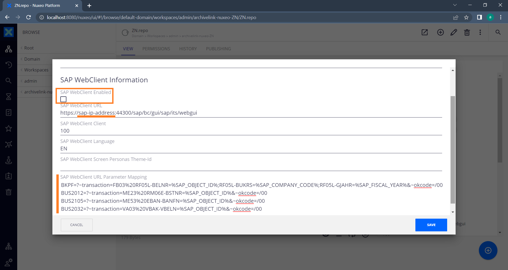
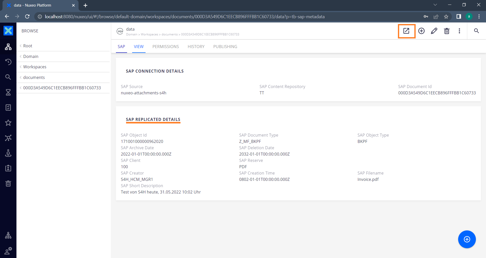

# Nuxeo - Reference for Feature *Open In SAP Web GUI*

The feature *Open in SAP Web GUI* allows the user in Nuxeo to open the document related SAP Business Object with a single click from the Nuxeo web application. It calls the SAP Web GUI and after the user has logged into the SAP system, he will be directly forwarded to the SAP Business Object, opened in its associated transaction.

### Requirements
1) The metadata replication is enabled and facet `SAP Replicated Details` is available on the document.
2) The feature has been enabled for the repository.
3) The SAP transaction is maintained in the properties.

## Administration
The feature can be enabled or disabled for each SAP Content Repository available in Nuxeo. Navigate to the repository folders underneath the **`aqilink`** administration path. The path is specified in parameter `adminPath` of the [Storage Connections for Nuxeo](/configuration/aqilink/#hyland-nuxeo-repository).
In each repository folder the repository file has the file extension `.repo`.

Edit the properties of the `.repo` file to maintain the following settings for the feature:

| Property      | Description |
| ----------- | ----------- |
| ``WebClient Enabled`` |  Either check the option to enable or disable the feature. Default: *Not enabled* Note: This setting is valid for all documents of this repository. | 
| ``WebClient URL`` |  The URL pointing to the SAP WebClient. Make sure to replace the placeholder *sap-ip-address* with the IP or hostname of the SAP server.   |  
| ``WebClient Client`` |  The Client used as preselection for the user login.   |  
| ``WebClient Language`` | The lanugage used as preselection for the user login.   |  
| ``WebClient Screen-Personas Theme Id`` | If there is any public Screen-Personas theme available, set the ID of the theme to be used after the user logged in.  |  
| ``WebClient URL Parameter Mapping`` | The most important part. It contains the mapping of the properties to the related SAP transaction.  |  

> Make sure to replace the placeholder *sap-ip-address* in property `SAP WebClient URL` with the IP or hostname of the SAP server. 

### Reference for URL Parameter Mapping
The following SAP Objects are currently supported by default:

| SAP Object Type | SAP Transaction | Description | URL Parameter attached to SAP WebGUI |
| ----------- | ----------- | ----------- | ----------- |
| BKPF | `FB03` | Accounting Document Header | `?~transaction=FB03%20RF05L-BELNR=%SAP_OBJECT_ID%;RF05L-BUKRS=%SAP_COMPANY_CODE%;RF05L-GJAHR=%SAP_FISCAL_YEAR%&~okcode=/00` |
| BUS2012| `ME23` | Purchase Order | `?~transaction=ME23%20RM06E-BSTNR=%SAP_OBJECT_ID%&~okcode=/00`|
| BUS2105| `ME53` | Purchse Requisition | `?~transaction=ME53%20EBAN-BANFN=%SAP_OBJECT_ID%&~okcode=/00`|
| BUS2032 | `VA03` | Sales Order | `?~transaction=VA03%%20VBAK-VBELN=%s&~okcode=/00` |

## Usage

Once the feature is enabled, this is the user experience in Nuxeo. 

1) The user navigates to a document which was stored from SAP. 
2) A new action command is available on the Document Actions menu.
   > The command is available as soon as the facet *SAP Replicated Details* is available on the document. Depending on the runtime of the [Task](/configuration/aqishare/tasks) job which adds this facet, this may take some time (the time specified in the [CRON expression](/configuration/aqishare/tasks#property-trigger)).

3) The user clicks the action command "Open in SAP".
4) The SAP WebGUI opens in a new browser session.
5) The user must enter his SAP credentials to login to the SAP system.
6) Once done, the user is immediately redirected to the SAP Business Object associated with the current document in Nuxeo. 

7) The user can now continue his work on the SAP Business Object.