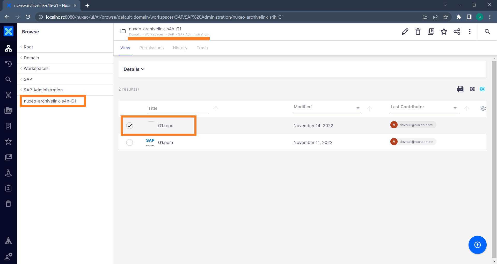
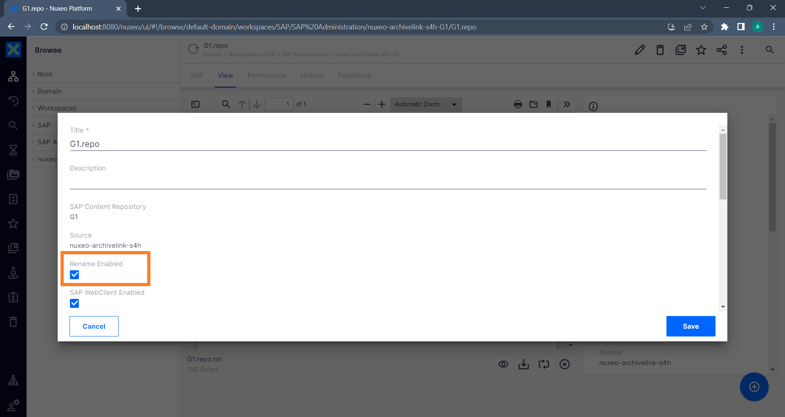
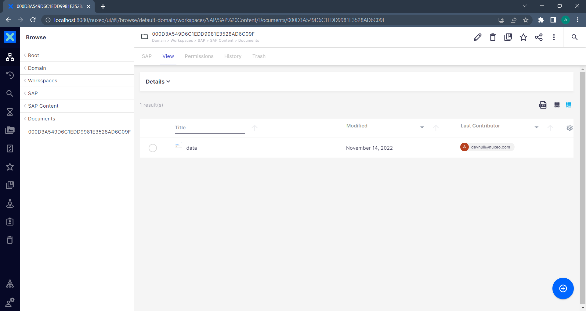
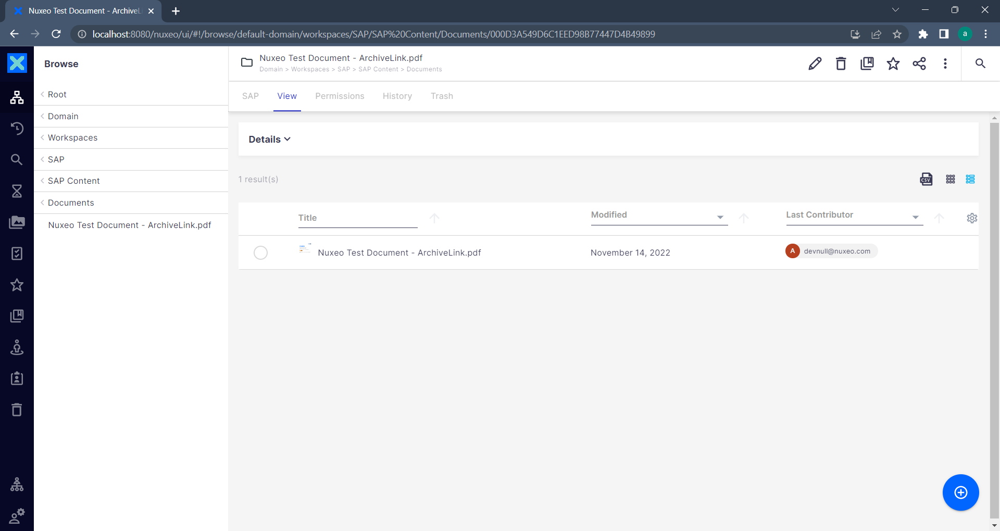
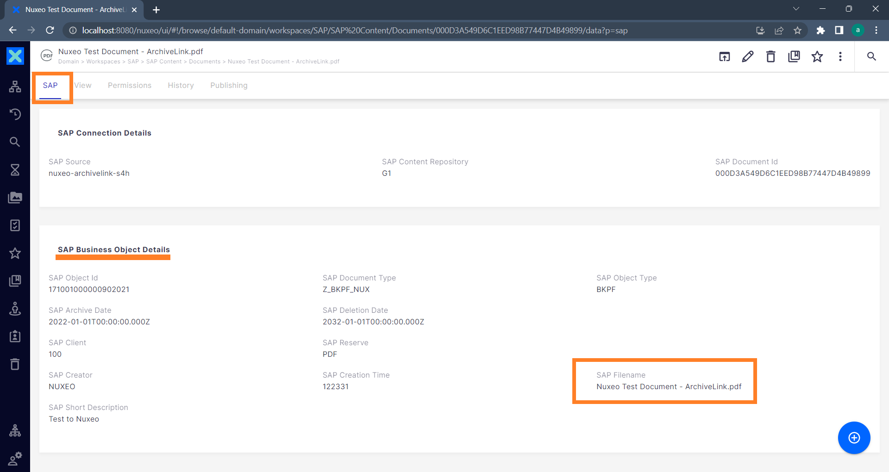

# Nuxeo - Reference for Feature *Rename*

The feature *Rename* (data file and parent folder) enables to rename all SAP ArchiveLink stored files to their original filename.

### Requirements
1) The metadata replication is enabled and facet `SAP Replicated Details` is available on the document.
2) The feature has been enabled for the repository.

## Administration
The feature can be enabled or disabled on each available SAP Content Repository file in Nuxeo which means, it is either enabled or disabled for all documents stored in this repository. The SAP Content Repository files are located under the related [SAP HTTP-Content Server Connection](/configuration/aqilink/#sap-http-content-server-connection) folder of the `aqilink` administration path in Nuxeo. 
The file extension is **`.repo`** and is located under the specified `adminPath` (in configuration file `storage.yaml`, refer to [Storage Connection for Hyland Nuxeo Repository](/configuration/aqilink/#hyland-nuxeo-repository)) in the repository.

Edit the properties of the `.repo` file to enable the feature:

> Note: Existing documents in Nuxeo are not touched by any change of this setting. The rename will work for new arriving documents only.

## User Expericence
Once the feature is enabled, the *data* file as well as the parent folder of each arriving SAP ArchiveLink document stored to this repository will be renamed with the original filename stored in SAP automatically. There is no additional action of the user required.

### Before renaming

Before enabling the *Rename* feature, the documents stored from SAP looks like below. The filename of the file is just *data* (without any extension) and the parent folder containing the components (such as the *data* document or a SAP note) will have the SAP ArchiveLink Document Id as name.

### After renaming
After the feature is enabled, the names of the folder and the *data* file will become the original filename once the `SAP Replicated Details` facet is available on the document.

The value of "SAP Filename" from the "SAP Business Object Details" will be used to rename the *data* file and the parent folder. 

