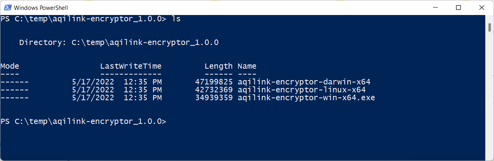

# Password Encryption

Password encryption is essential to store user credentials securely. Without password encryption, anyone accessing the 
configuration files for **`aqilink`** could easily view any stored passwords by default, because it is stored as plain text. To avoid this potential security risk, it is possible to encrypt all passwords in the configuration files with an encryptor tool. The tool uses the asymmetric RSA algorithm to encrypt the passwords. 


## Download the encryptor tool
We offer the password encrypton tool for various platforms such as Windows, Unix and Mac on x64 system architecture. The encryptor tool package contains the executables for each of the mentioned platforms and can be downloaded from the delivery portal. 

> The download link for the `aqilink-encryptor` is available in the [Software Download section](/installation/app-download.md#other-related-software)!

Once downloaded, extract the package and continue with the correct executable according your current system architecture.




## Using the encryptor tool
To encrypt passwords in any of the **`aqilink`** configuration files follow the steps below. It demonstrates the usage on a Windows system. If you platform is Unix or Max, use related commands.

### Generate key pair 
Execute the encryptor tool based based on your system architecture to create a new private key and public key pair. Both keys are stored in separate files within the given directory (in the case below `c:\temp\aqilink\keypair`). Make sure the given directory exists.

```
.\aqilink-encryptor-win-x64.exe generate c:\temp\aqilink\keypair
``` 

### Map public key into container
   
To allow the usage of the encrypted passwords based on the the newly created public key, the file be available inside the container of ```aqilink```. Depending on the used containerization tool, the method to make files available depends (either map it or copy it).  

### Enable usage
Once the public key file is available inside the container, ```aqilink``` must know about it to use it. In order to make  ```aqilink``` aware of the file, the path of the public key file in the container must be added to the ```app.yaml``` in the ```/configs/``` directory by specifying the value for property ```publicKeyPath```.

```
publicKeyPath: /usr/src/app/configs/publicKey.pem
```

### Create encrypted passwords 
To create encrypted passwords the following command of the encryptor tool has to be used:
```
.\aqilink-encryptor.exe encrypt MY_PASSWORD_TO_ENCRYPT --privateKeyPath c:\temp\aqilink\keypair\privateKey.pem
```

The output will be like:
```
Encrypted Password:
ENC(lax/tcmsuMMOsQccajvjJdT9pdb4NyluqW+42SC7jiDKUmTLGmHtl+hyL27Z/bainuUKbxfsHggXjLEFWQaoANt/UwkIJT3k0BJZd5yS+i+RcBSPuLNJ52RHxRx65UrAFViV1qLT6gOyT5OnsXRZL1xke8j3HhD2JlRmxOLc/AjiSEeVe4nC190h9d2D6TXeAdq6QoD6TbtvUrI17P4cyqPS3fetgirq7hm6EDjh6eWKHU9i9p9FEi3B8QjZCasLf+5bO/qN7MNcgLXD2gQAHRZYdVoAX+p7oCQ8DT3WemmzLCL1W0VjEul3aE0Yo5mNFOaD+oK89eQi4Q2qNrCqmQ==)
```
Copy the line starting with the **ENC()** function and paste it as value for the desired password value in one of the **`aqilink`** configuration files (such as [`storage.yaml`](/configuration/aqilink/#storage-connections) or  [`sapConnection.yaml`](/configuration/aqishare/#sap-connection)). 

For examples, refer to the related Refernce Configuration Files for:
 * [Nuxeo](/reference/nuxeo-reference-configs.md) or 
 * [Amazon S3](/reference/s3-reference-configs.md)