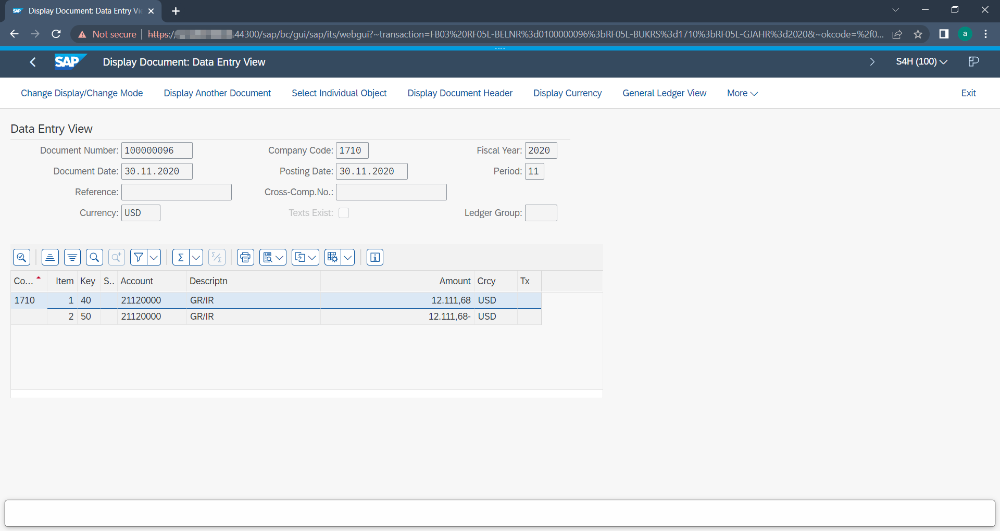

# SharePoint - Reference for Feature *Open SAP Business Object*

The feature *Open SAP Business Object* allows the user in SharePoint Online to open the related SAP Business Object of the current selected document by one click in the menu actions. The SAP Web GUI opens in a new window and after the user has logged into the SAP system, he will be directly forwarded to the SAP Business Object using the right transaction code. The feature comes with a list of pre-defined supported SAP Object Types. It is possible to extend this list with any other SAP Object Types (regardless of SAP Standard or custom types) easily.

### Requirements
1) The metadata replication is enabled and all metadata, required to invoke the desired SAP transaction, are present on the document.
2) The document in SharePoint must be of type `SAP Replicate` (will be changed automatically, once the metadata replication was successfull).
3) All metadata, required to invoke the desired SAP transaction code, must be present on the document.
4) The feature has been enabled for the repository (see below).
5) The SAP transaction is maintained in the configuration file (see below).

## Administration
The feature can be configured for each available SAP Content Repository in SharePoint (combination of SAP Source and SAP ArchiveID. To enable the command for all documents from a SAP Content Repository, follow these steps:
  1) Navigate to the folder in SharePoint where the SAP Content Repository files and SAP Certificates are stored (refer to `adminPath` in the [`storage.yaml`](../configuration/aqilink/#microsoft-sharepoint-online-spo)) and select the desired SAP Content Repository folder (in the picture below it is `M1`) where the feature should be enabled. Right now, each SAP Repository folder only contains the `.repo` and the `.pem` file.
  
   

  2) The configuration of the feature is driven by a new *`JSON`* file that must be uploaded to this folder. Create a new file with the name `M1`.**`webgui.json`**. Most important is the file extension `webgui.json`, while the name doesn't matter. However, we recomment to name the file like the respository name.
   
   

  3) Open the file and edit the content as per your requirements. For detailed property descriptions refer to next section.
   
   

### Schema definition for `*.webgui.json`
Refer to the image above.

| Property      | Type      | Description |
| ----------- | ----------- | ----------- |
| ``enabled`` | Boolean | Whether to enable or disable the feature for the repository. If the `*.webgui.json` file is not available at all for a repository, the feature is disabled. | 
| ``url`` | String | The URL pointing to the SAP WebClient. Make sure to replace the placeholder *sap-ip-address* with the IP or hostname of the SAP server.   |  
| ``mapping`` | Array |  Contains the mapping between the SAP Object (key) and the required URL parameter with placeholder names to invoke the SAP transaction. The value will be appended to the `url`. You can extend the mapping by your needs.  |

#### Reference for URL Parameter Mapping
The following SAP Objects are currently supported by default for the `mapping` parameter:

| SAP Object Type | SAP Transaction | Description | URL Parameter attached to SAP WebGUI |
| ----------- | ----------- | ----------- | ----------- |
| BKPF | `FB03` | Accounting Document Header | `?~sap-client=%%SAPMandt%%&~transaction=FB03%20RF05L-BELNR=%%SAPObjectID{4:14}%%;RF05L-BUKRS=%%SAPObjectID{0:4}%%;RF05L-GJAHR=%%SAPObjectID{14:18}%%&~okcode=/00` |
| BUS2012| `ME23` | Purchase Order | `?~transaction=ME23%20RM06E-BSTNR=%%SAPObjectID%%&~okcode=/00`|
| BUS2105| `ME53` | Purchse Requisition | `?~transaction=ME53%20EBAN-BANFN=%%SAPObjectID%%&~okcode=/00`|
| BUS2032 | `VA03` | Sales Order | `?~transaction=VA03%20VBAK-VBELN=%%SAPObjectID%%&~okcode=/00` |
| EQUI | `IE03` | Equipment | `?~sap-client=%%SAPMandt%%&~transaction=IE03%20RM63E-EQUNR=%%SAPObjectID%%&~okcode=/00` |
| PREL | `PA20` | HR Master Data | `?~sap-client=%%SAPMandt%%&~transaction=PA20%20RP50G-PERNR=%%SAPObjectID{0:8}%%&~okcode=/00` |

##### Add additional SAP transactions
It's easily possible to add another SAP transaction to the mapping. Just keep the following in mind:
 * Enter the exact field names from the datamodel in SharePoint.
 * Surround the field names with `%%` (double percentage sign). With that, the field name will be replaced by it's value during runtime.
 * To use a substring of a field value use syntax `{fromIndex,toIndex}` after the field name. With that, only the substring will be used as value.

##### Example for SAP Object Type mapping `BKPF`:
The following parameter mapping (see table above) will be appended to the SAP WebGUI url if the SAP Object type value on the document is `BKPF`:

`?~sap-client=`**`%%SAPMandt%%`**`&~transaction=FB03%20RF05L-BELNR=`**`%%SAPObjectID{4:14}%%`**`;RF05L-BUKRS=`**`%%SAPObjectID{0:4}%%`**`;RF05L-GJAHR=`**`%%SAPObjectID{14:18}%%`**`&~okcode=/00`

 - `%%SAPMandt%%` will be replaced with value `100` (see picture below). Note that *SAP Client* is the *Display Name*, but the field name must refer to the *Name* only.
- ``%%SAPObjectID{4:14}%%`` will use the value of *SAP Object ID* from the document, which is `171001000000772022` - **but** as there is a substring specified, only characters of the specified range between 4 to 14 are used, which means, the final value will be: `0100000077` (Invoice number)!
- ``%%SAPObjectID{0:4}%%`` will use the value of *SAP Object ID* from the document, which is `171001000000772022` - **but** as there is a substring specified, only characters of the specified range between 0 to 4 are used, which means, the final value will be: `1710` (company code)!
- ``%%SAPObjectID{14:18}%%`` will use the value of *SAP Object ID* from the document, which is `171001000000772022` - **but** as there is a substring specified, only characters of the specified range between 14 to 18 are used, which means, the final value will be: `2022` (fiscal year)!

   

## Usage

Once the feature is enabled, this is the user experience in SharePoint Online. 

1) The user navigates to a document that has been stored from SAP. 
2) In the Document Library a new action command is available in the menu.
   > The command is available as soon as the Content Type has changed to *SAP Replicate* (which means, additional metadata are now available on the document). Refer to the related [Task](/configuration/aqishare/tasks) configuration.

   > **Note:** The document must be indexed by SharePoint before the [CRON expression in the Task](/configuration/aqishare/tasks#property-trigger) is able to find it! Usually, it takes up to 15 minutes or more until a document is indexed by SharePoint. 
   

1) The user clicks the action command "Open SAP Business Object".
2) The SAP WebGUI opens in a new browser session.
3) The user has to enter his SAP credentials to login to the SAP system.
4) Now, he will be immediately redirected to the SAP Business Object associated with the current document in Nuxeo. 

1) The user can now continue his work on the SAP Business Object.